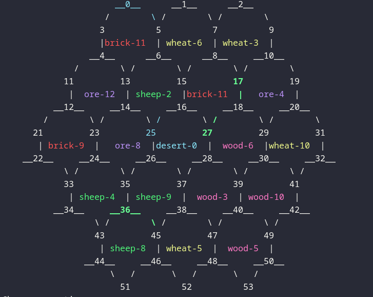
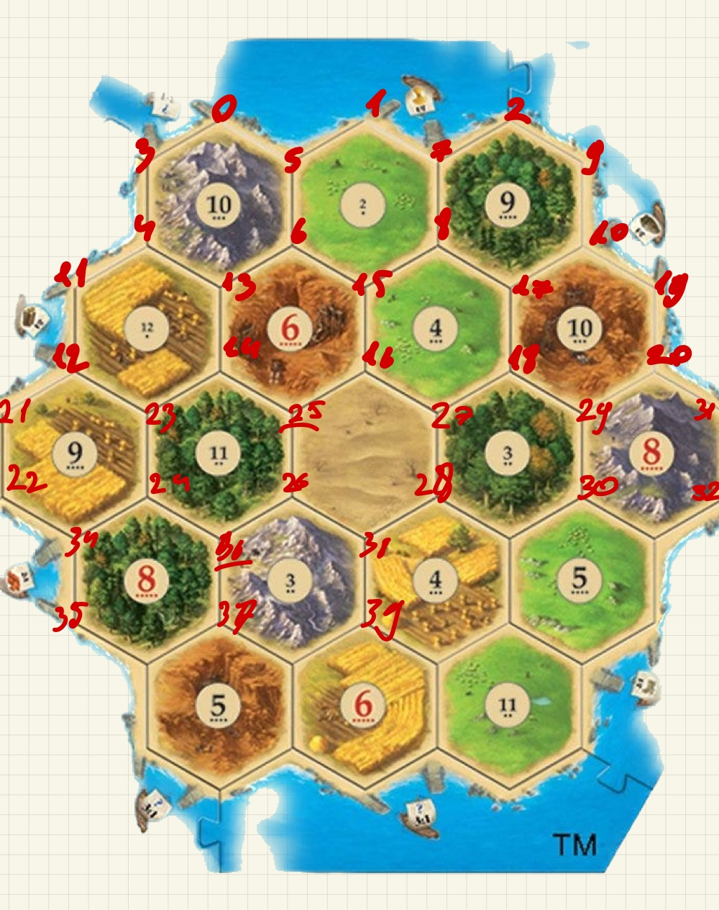
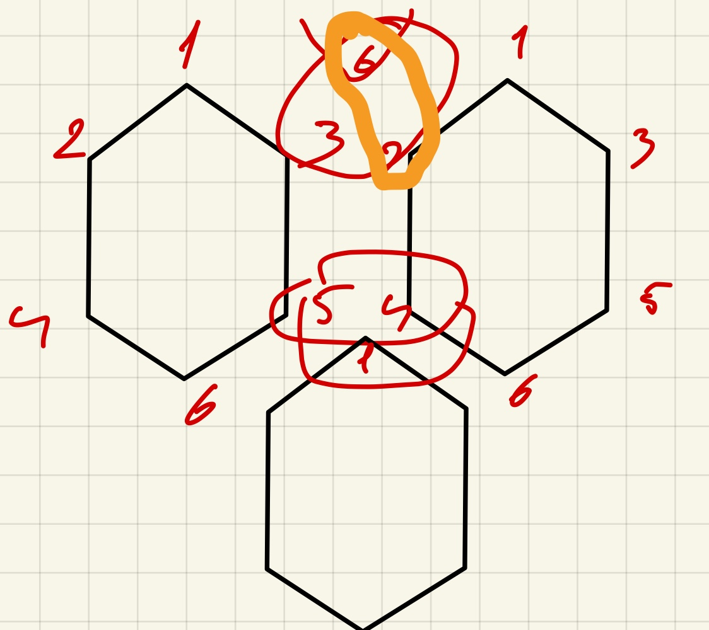
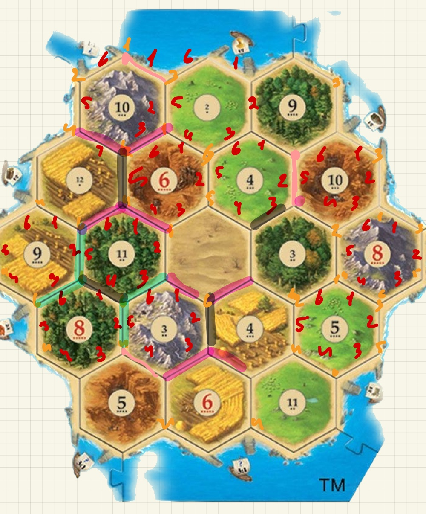
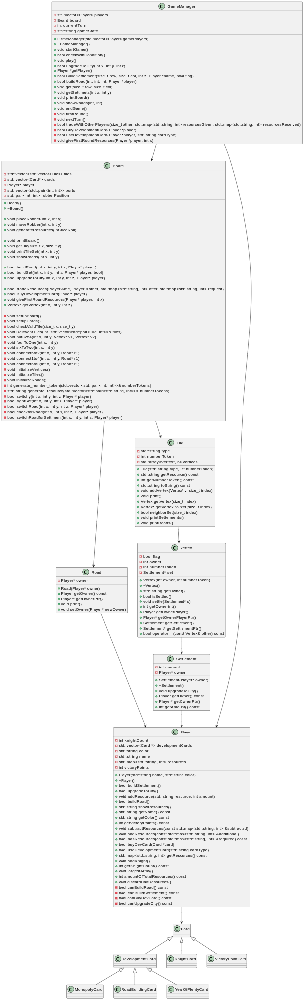
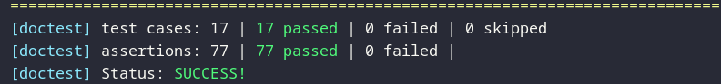
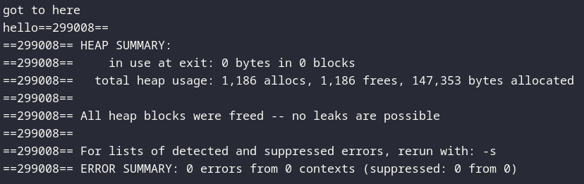

# Catan

## Description

I created an interactive Catan game

## Table of Contents

- [Installation](#installation)
- [Manu-Game](#Manu-Game)
- [Usage](#usage)
- [TestCases](#TestCases)
- [RelatedImages](#RelatedImages)
- [Contact](#contact)


## Installation
for Arch:
```
    yay valgrind
```
```
    yay coredumpctl
```
for Ubuntu:
```
    sudo apt install valgrind 
```
```
    sudo apt install systemd-coredump  
```

## Manu-Game
There are 9 modes when playing the game 
1. Build a settlement in a givent cordinates
2. Buy development card
3. Build a road
4. Upgrade settlment
5. Trade with other players
6. next turn
7. print board
8. show resources
9. use development card

## Usage

to compile the code you can make "all" target
```
    make all##
```
to run the game use 
```
    ./catan
```
to run a shell script to run a couple of moves in the game
```
    make run
    or 
    ./!run_game.sh
```
to run the test that I wrote use 
```
    make test
    ./test
```
to check memory loss leak you can use 
```
    make valgrind
```
and to debug the code using coredumpctl and gdb (make sure you have installed the requirments)
```
    make debug
```


Examples of how to use the project:
change catan file to this
```
    //create players that will play the game
    Player *p1 = new Player("name","color");
    Player p2 = new Player("name2","color2");
```
```
    GameManager gamemanager({*p1,*p2}); // create the gameManager kind of facade for easy use
```
```
    while(!gameManager.checkWinCondition())
    {
        gameManager.play();// every player in his turn will do whatever he want

    }
```
and to finally run the code
```
    ./catan 
```
## TestCases

### Player Test Cases

- **Creation of Player**: Initializes a player object, verifying basic properties like name and color.
- **Add Resources**: Adds resources to a player's inventory, testing the addition functionality.
- **Subtract Resources**: Removes resources from a player's inventory, ensuring accurate subtraction.
- **Build Settlement**: Constructs a settlement, validating resource requirements and player state updates.
- **Build Road**: Builds roads, confirming resource usage and player status changes.
- **Upgrade to City**: Upgrades settlements to cities, checking resource availability and state transitions.
- **Buy Development Card and Use**: Purchases and uses development cards, impacting player state and resources.
- **Amount of Victory Points**: Calculates victory points based on player actions and resources.
- **Show Resources**: Displays current resources held by a player.
- **Discard Half Resources**: Discards half of a player's resources, verifying operation accuracy.

### Board Test Cases

- **Check Dice Generation**: Validates the generation of dice rolls and their effects on gameplay.

### Settlement Test Cases

- **Settlement Creation**: Creates a settlement, including ownership and upgrade functionalities.

### Tile Test Cases

- **Tile Creation**: Verifies the creation of tiles, focusing on resource type and quantity attributes.

### Card Test Cases

- **Card Creation**: Confirms the creation of various card types (e.g., KnightCard, VictoryPointCard) and their identification.

### Vertex Test Cases

- **Vertex Creation**: Sets up vertices properly, including settlement placement and ownership tracking.

### Road Test Cases

- **Road Creation**: Validates the creation of roads, emphasizing ownership and connection verification.

### GameManager Test Cases

- **GameManager Test Case**: Covers the initiation of the game, player interactions, and win condition evaluations.
# Game Development Visual Aids

This section contains various images that were instrumental during the development of our game. These visuals helped us conceptualize different aspects of the game, such as the board layout, vertex connections, road checks, and the overall structure through UML diagrams.

## Board Layout and Vertex Connections

### Final Board After Last Test


This image shows the final state of the game board after executing the last round of tests.

### Desired Board Appearance (Vertex-wise)


An illustration of how the game board should ideally appear when considering the vertices.

### Connecting Close Vertices


A visual guide on how we connect vertices that are in close proximity to each other.

## Road Checks and UML Diagrams

### Checking for Close Roads


This diagram explains our approach to checking for roads that are close to each other on the game board.

### UML Diagram for Cards


A UML diagram outlining the structure and relationships of the card system within the game.

### Overall Game UML Diagram


A comprehensive UML diagram that represents the entire game's architecture and component interactions.

## Testing and Validation

### Successful Test Completion


A screenshot indicating that all tests have been successfully completed.

### Memory Leak Check with Valgrind


The result of a memory leak check using Valgrind, confirming no leaks were detected.

## Contact
Roi Sibony, Roisi20041@gmail.com
